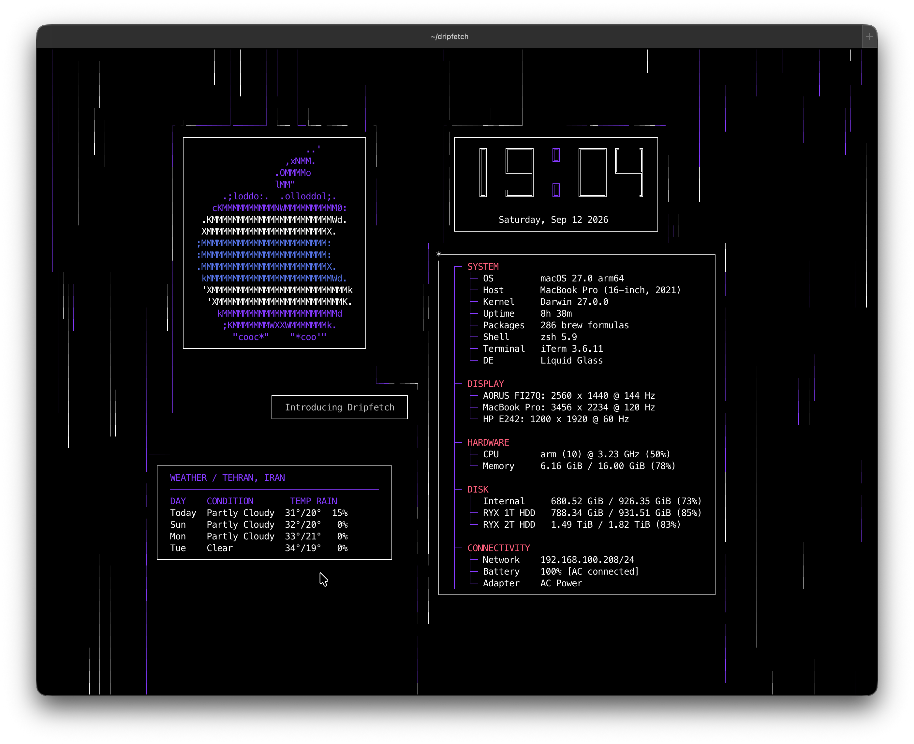
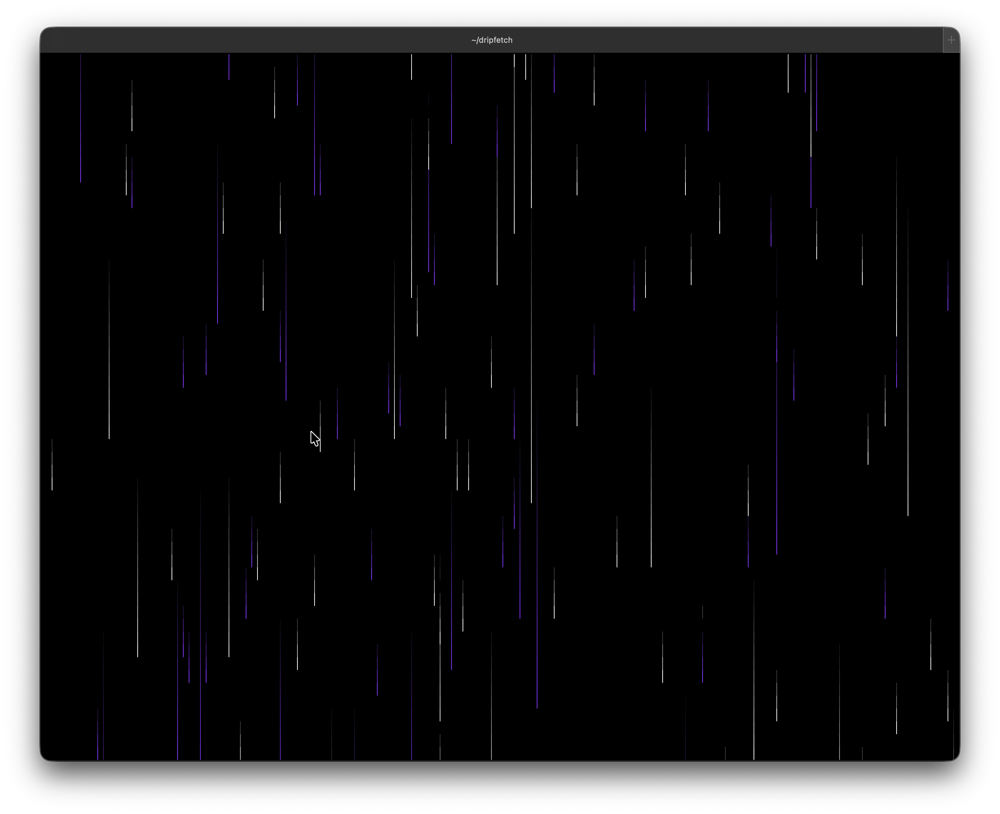
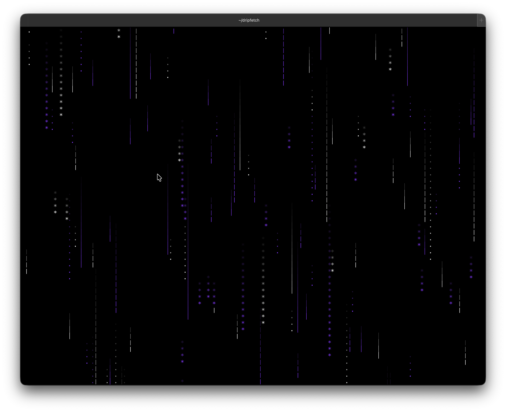
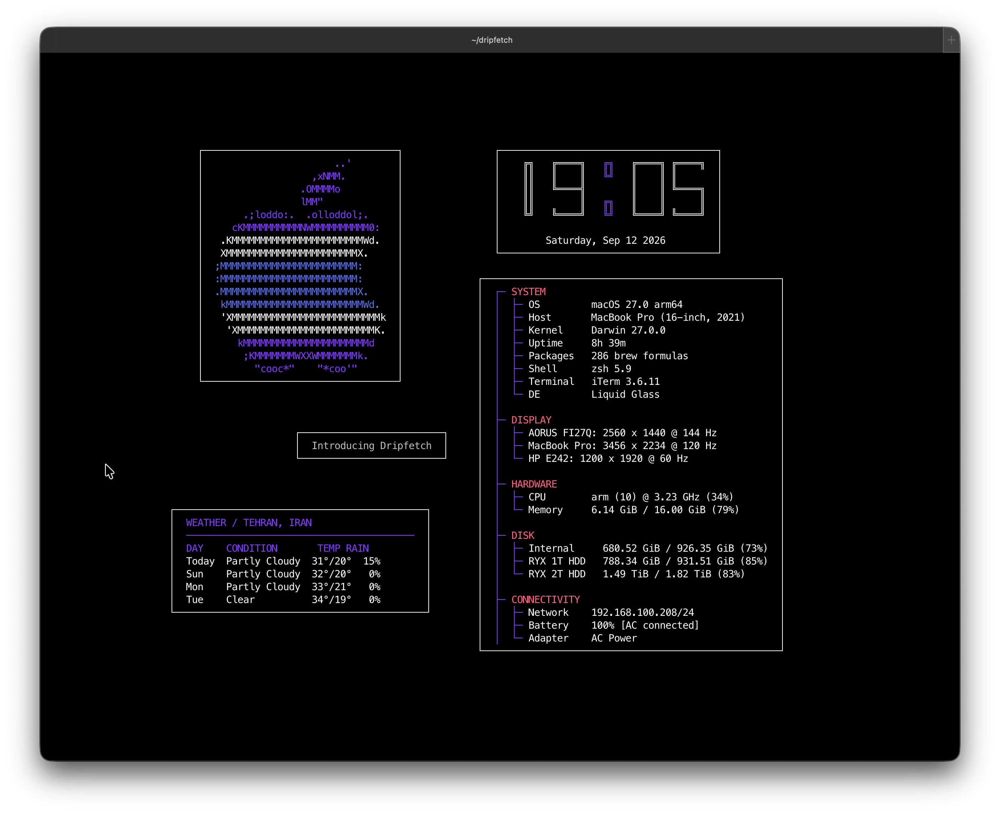

# Dripfetch

<p align="center">
  
</p>

<p align="center">
  A customizable terminal system information display with animated rain.
</p>

<p align="center">
  <a href="https://github.com/a-shygun/dripfetch/issues">Issues</a>
</p>

---

## What is Dripfetch?

Dripfetch is a customizable terminal TUI that combines system information, animated rain, clocks, logos, text, and other information into a single configurable display.

Everything is controlled through a YAML configuration file, allowing you to customize the appearance and layout without modifying the source code.

### Features

- Animated terminal rain
- System information
- Large customizable clock
- ASCII and text boxes
- Platform logos
- Weather information
- Mouse interaction
- Keyboard-controlled box movement
- Multiple keyboard layouts
- Custom colors, borders, padding, and positioning
- YAML configuration
- ANSI-based terminal rendering

---

## Screenshots & Demo

<p align="center">
  
</p>

<p align="center">
  
</p>

<p align="center">
  
</p>

<p align="center">
  
</p>

A short terminal recording is also available:

**[Watch the Dripfetch demo](docs/dripfetch.mov)**

---

# Installation

## PyPI

The easiest way to install Dripfetch is through PyPI:

```bash
pip install dripfetch
```

Then run:

```bash
dripfetch
```

---

## Install from source

If you want to install the latest source directly from GitHub:

```bash
git clone https://github.com/a-shygun/dripfetch.git
cd dripfetch
pip install .
```

Then:

```bash
dripfetch
```

### Using the installation script

The repository also includes an installation script that creates an isolated virtual environment and installs Dripfetch into it.

```bash
git clone https://github.com/a-shygun/dripfetch.git
cd dripfetch
chmod +x install.sh
./install.sh
```

The script:

- Creates `~/dripfetch`
- Creates a virtual environment at `~/dripfetch/.venv`
- Installs Dripfetch into the virtual environment
- Creates `~/.local/bin/dripfetch`
- Adds `~/.local/bin` to your shell PATH when necessary

Python 3 is still required for this method.

---

# Usage

Start Dripfetch with:

```bash
dripfetch
```

Basic controls:

| Key | Action |
|---|---|
| `q` | Quit |
| `Space` | Pause/resume rain |
| `W A S D` | Move selected box |
| Arrow keys | Move selected box |
| `Esc` | Deselect box |
| Mouse | Select a box |

Dripfetch supports different keyboard layouts, including QWERTY, AZERTY, and QWERTZ.

---

# Configuration

Dripfetch uses a YAML configuration file.

Create or restore the default configuration:

```bash
dripfetch --init-config
```

Show the active configuration path:

```bash
dripfetch --config-path
```

Use a custom configuration:

```bash
dripfetch --config path/to/config.yaml
```

The configuration file controls the appearance, layout, boxes, rain, colors, borders, padding, and other behavior.

---

# Uninstallation

If you installed Dripfetch with `pip`:

```bash
pip uninstall dripfetch
```

If you installed it using `install.sh`, run the included uninstall script from the repository:

```bash
chmod +x uninstall.sh
./uninstall.sh
```

The uninstall script removes the Dripfetch virtual environment and command symlink while preserving:

```text
~/dripfetch
~/.config/dripfetch/config.yaml
```

This means your source files and configuration are not automatically deleted.

If you want to completely remove the remaining installation directory:

```bash
rm -rf ~/dripfetch
```

To also remove your Dripfetch configuration:

```bash
rm -rf ~/.config/dripfetch
```

---

# Next Update

The next update is planned to expand Dripfetch beyond its current feature set.

Planned improvements include:

- Adding more box types
- Adding Dripfetch to Homebrew
- Adding packages for Linux package managers
- Creating a complete Dripfetch Wiki with detailed documentation
- Expanding configuration and customization documentation

---

# Development

Clone the repository:

```bash
git clone https://github.com/a-shygun/dripfetch.git
cd dripfetch
```

For development, an editable installation is recommended:

```bash
pip install -e .
```

Run the test suite:

```bash
pytest
```

---

# License

Dripfetch is released under the [MIT License](LICENSE).