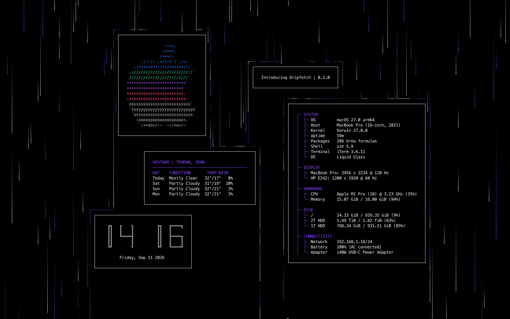

# dripfetch

A customizable terminal system information display with animated rain.

`dripfetch` is a terminal-based system information dashboard built with Python and `curses`. It combines configurable information boxes with an animated rain effect, custom colors, ASCII logos, and optional weather information.

The entire interface is configured through a YAML file, allowing the layout and appearance to be changed without modifying the source code.


## Features

- Animated terminal rain
- System information display
- Configurable information boxes
- ASCII distribution and system logos
- Digital clock
- Weather information and forecasts
- Custom colors, including RGB/RGBA colors
- Configurable rain characters, colors, speeds, and lengths
- Configurable box borders and padding
- Relative box positioning
- YAML-based configuration
- Automatic default configuration generation
- Terminal-native rendering using `curses`
- macOS and POSIX support
- No external services required for basic system information

## Requirements

- Python 3.12 or newer
- A terminal with `curses` support
- POSIX-compatible operating system

`dripfetch` currently targets macOS and POSIX systems.

## Installation

### PyPI

Install the latest released version with:

```bash
pip install dripfetch
```

Run it with:

```bash
dripfetch
```

Alternatively:

```bash
python -m dripfetch
```

### From source

Clone the repository:

```bash
git clone https://github.com/a-shygun/dripfetch.git
cd dripfetch
```

Create a virtual environment:

```bash
python3 -m venv .venv
source .venv/bin/activate
```

Install the project:

```bash
pip install .
```

Then run:

```bash
dripfetch
```

## First Run

On the first run, `dripfetch` automatically creates its configuration file:

```text
~/.config/dripfetch/config.yaml
```

The default configuration is bundled with the package and copied to the user's configuration directory when needed.

You can edit the configuration directly:

```bash
nano ~/.config/dripfetch/config.yaml
```

or with your preferred editor:

```bash
$EDITOR ~/.config/dripfetch/config.yaml
```

After changing the configuration, simply restart `dripfetch`.

## Configuration

`dripfetch` uses YAML for configuration.

A configuration consists of several top-level sections:

```yaml
background:
  color: "#000000"

rain:
  enabled: true
  collision: true
  intensity: 500

boxes:
  border: single
  border_color: "#FFFFFF"
  text_color: "#FFFFFF"
  accent_color: "#5DFF9C"
  padding:
    horizontal: 2
    vertical: 1
  items:
    ...
```

The configuration is intentionally declarative. Boxes describe what should be displayed and where it should appear, while the application handles rendering and updates.

## Background

The terminal background can be configured with:

```yaml
background:
  color: "#000000"
```

Colors can be specified as:

```text
#RRGGBB
```

or with an alpha component:

```text
#RRGGBBAA
```

For example:

```yaml
background:
  color: "#101010"
```

## Rain

The rain effect is controlled by the `rain` section.

Example:

```yaml
rain:
  enabled: true
  collision: true
  intensity: 500
  character: "│"

  colors:
    - [0.50, "#5DFF9C"]
    - [0.30, "#FFFFFF"]
    - [0.20, "#8747FF"]

  speeds:
    - [0.70, 1]
    - [0.25, 2]
    - [0.05, 3]

  lengths:
    - [0.60, 8]
    - [0.30, 12]
    - [0.10, 16]
```

### `enabled`

Controls whether the rain effect is displayed.

```yaml
enabled: true
```

### `collision`

Controls whether rain interacts with rendered box regions.

```yaml
collision: true
```

When enabled, rain drops can be affected by box boundaries rather than simply passing through them.

### `intensity`

Controls the number of rain drops being generated.

```yaml
intensity: 500
```

Higher values produce denser rain and require more rendering work.

### `character`

Defines the character used for rain drops.

```yaml
character: "│"
```

Other possible characters include:

```yaml
character: "|"
```

```yaml
character: "·"
```

```yaml
character: "┃"
```

### Weighted values

Rain colors, speeds, and lengths use weighted lists.

For example:

```yaml
colors:
  - [0.70, "#5DFF9C"]
  - [0.20, "#FFFFFF"]
  - [0.10, "#8747FF"]
```

The first value is the probability weight and the second value is the selected value.

Weights must add up to approximately `1`.

The same system is used for speeds and lengths:

```yaml
speeds:
  - [0.80, 1]
  - [0.20, 2]
```

```yaml
lengths:
  - [0.70, 8]
  - [0.30, 12]
```

## Boxes

Most of the interface is composed of boxes.

A box can define:

- Its type
- Its border
- Its position
- Type-specific settings

Example:

```yaml
boxes:
  items:
    - type: text
      text: "Hello, world!"
```

Available box types are currently:

```text
text
clock
sysinfo
logo
weather
```

## Box Borders

The default border is configured under `boxes`:

```yaml
boxes:
  border: single
```

Available border styles:

```text
single
double
```

For example:

```yaml
boxes:
  border: double
```

A box can also override the default border:

```yaml
- type: text
  text: "Example"
  border: double
```

## Box Colors

Global box colors can be configured with:

```yaml
boxes:
  border_color: "#FFFFFF"
  text_color: "#FFFFFF"
  accent_color: "#5DFF9C"
```

These provide the default visual palette used by the different box types.

## Box Padding

Padding is configured globally:

```yaml
boxes:
  padding:
    horizontal: 2
    vertical: 1
```

`horizontal` controls the left and right padding.

`vertical` controls the top and bottom padding.

## Box Positioning

Boxes support configurable horizontal and vertical positioning:

```yaml
position:
  horizontal: 10
  vertical: 5
```

Negative values can be used to position elements relative to the opposite side of the terminal.

For example:

```yaml
position:
  horizontal: -10
  vertical: -5
```

This allows layouts to remain useful across different terminal sizes without hard-coding absolute coordinates.

## Text Box

The text box displays arbitrary text.

Example:

```yaml
- type: text
  text: "Welcome to dripfetch"
```

It can also be positioned:

```yaml
- type: text
  text: "Hello"
  position:
    horizontal: 5
    vertical: 2
```

## Clock Box

The clock displays the current time and can be customized through several options.

Example:

```yaml
- type: clock
```

### Clock style

Available styles:

```text
single
double
```

Example:

```yaml
- type: clock
  clock_style: double
```

### Clock size

Available sizes:

```text
medium
big
```

Example:

```yaml
- type: clock
  clock_size: big
```

### 24-hour clock

```yaml
- type: clock
  clock_24h: true
```

### Seconds

```yaml
- type: clock
  show_seconds: true
```

### AM/PM

```yaml
- type: clock
  show_am_pm: true
```

### Blinking colon

```yaml
- type: clock
  blink_colon: true
```

### Date

```yaml
- type: clock
  show_date: true
```

Options can be combined:

```yaml
- type: clock
  clock_style: double
  clock_size: big
  clock_24h: true
  show_seconds: true
  show_date: true
```

## System Information Box

The system information box displays information about the current machine.

Example:

```yaml
- type: sysinfo
```

The box supports configurable text, title, and line colors:

```yaml
- type: sysinfo
  colors:
    text: "#FFFFFF"
    title: "#5DFF9C"
    line: "#444444"
```

The system information implementation uses `psutil` where appropriate to obtain system information.

## Logo Box

The logo box displays ASCII logos bundled with `dripfetch`.

Example:

```yaml
- type: logo
  logo: macos3
```

Logos are stored inside the installed package and therefore remain available when `dripfetch` is installed through PyPI.

### Logo colors

Multiple colors can be supplied:

```yaml
- type: logo
  logo: macos3
  colors:
    - "#FFFFFF"
    - "#5DFF9C"
    - "#8747FF"
    - "#FF5681"
```

Logo files can use color markers to switch between these colors.

For example, a logo can contain markers such as:

```text
$1
$2
$3
```

These refer to the corresponding entries in the configured color list.

### Available logos

The package contains a large collection of operating-system and distribution logos.

Examples include:

```text
macos3
alpine
almalinux
aerynos
afterglow
aix
adelie
aeon
aeros
zorin
xubuntu
```

The exact set of available logos is determined by the files bundled under:

```text
src/dripfetch/assets/logos/
```

A logo is selected by its filename without the `.txt` extension.

For example:

```text
src/dripfetch/assets/logos/macos3.txt
```

is selected with:

```yaml
logo: macos3
```

## Weather Box

The weather box retrieves weather information using Open-Meteo.

Example:

```yaml
- type: weather
  location: Tehran
```

A complete example:

```yaml
- type: weather
  location: Tehran
  units: metric
  position:
    horizontal: 43
    vertical: 2
```

The weather box can also be configured using geographic coordinates:

```yaml
- type: weather
  latitude: 35.6892
  longitude: 51.3890
```

Either a location or both latitude and longitude must be provided.

The weather component retrieves data asynchronously so that network requests do not block the terminal interface.

Weather data is cached for a limited period to avoid repeatedly requesting the same information.

## Example Configuration

A simple configuration might look like:

```yaml
background:
  color: "#000000"

rain:
  enabled: true
  collision: true
  intensity: 500
  character: "│"

  colors:
    - [0.60, "#5DFF9C"]
    - [0.25, "#FFFFFF"]
    - [0.15, "#8747FF"]

  speeds:
    - [0.80, 1]
    - [0.20, 2]

  lengths:
    - [0.70, 8]
    - [0.30, 12]

boxes:
  border: single
  border_color: "#FFFFFF"
  text_color: "#FFFFFF"
  accent_color: "#5DFF9C"

  padding:
    horizontal: 2
    vertical: 1

  items:
    - type: logo
      logo: macos3
      colors:
        - "#FFFFFF"
        - "#5DFF9C"
        - "#8747FF"
        - "#FF5681"
      position:
        horizontal: -46
        vertical: -18

    - type: clock
      clock_style: double
      clock_size: big
      clock_24h: true
      show_seconds: true
      show_date: true

    - type: sysinfo

    - type: weather
      location: Tehran
      units: metric
      position:
        horizontal: 43
        vertical: 2
```

## Configuration Validation

The configuration is validated before it is used.

Invalid values produce configuration errors rather than allowing malformed settings to propagate into the renderer.

Examples of validation include:

- Invalid YAML
- Unknown box types
- Invalid border types
- Invalid colors
- Invalid boolean values
- Invalid numeric values
- Negative rain intensity
- Invalid weighted lists
- Invalid clock settings
- Invalid geographic coordinates
- Missing weather location or coordinates
- Empty logo names

For example, an invalid color:

```yaml
text_color: "red"
```

will be rejected because colors must use the supported hexadecimal format.

Use:

```yaml
text_color: "#FF0000"
```

instead.

## Configuration Location

The default configuration file is:

```text
~/.config/dripfetch/config.yaml
```

The application creates the directory automatically when the configuration does not exist.

The default configuration shipped with the package is:

```text
dripfetch/default_config.yaml
```

The packaged default is used to initialize a user's configuration.

## Command Line

The main command is:

```bash
dripfetch
```

Python module execution is also supported:

```bash
python -m dripfetch
```

The command starts the terminal interface using the user's configuration.

## Controls

The terminal interface is intended to run continuously.

Use:

```text
Ctrl+C
```

to exit the application.

Depending on the terminal, an interrupt may also be generated by closing the terminal or sending an interrupt signal.

## Performance

`dripfetch` continuously redraws an animated terminal interface, so rendering cost depends primarily on:

- Terminal dimensions
- Rain intensity
- Number of active drops
- Box complexity
- Rain collision
- Terminal refresh rate
- Terminal emulator performance

If the application uses too much CPU, reduce the rain intensity:

```yaml
rain:
  intensity: 250
```

A lower intensity means fewer active drops and less terminal rendering work.

Disabling collision can also reduce the amount of work performed by the rain system:

```yaml
rain:
  collision: false
```

## Project Structure

The project uses a `src` layout:

```text
dripfetch/
├── LICENSE
├── README.md
├── install.sh
├── uninstall.sh
├── pyproject.toml
├── dist/
├── src/
│   └── dripfetch/
│       ├── __init__.py
│       ├── __main__.py
│       ├── app.py
│       ├── cli.py
│       ├── config.py
│       ├── default_config.yaml
│       ├── terminal.py
│       ├── assets/
│       │   └── logos/
│       ├── box/
│       │   ├── base.py
│       │   ├── borders.py
│       │   ├── colors.py
│       │   ├── manager.py
│       │   ├── placement.py
│       │   └── types/
│       │       ├── clock.py
│       │       ├── logo.py
│       │       ├── sysinfo.py
│       │       ├── text.py
│       │       └── weather.py
│       └── rain/
│           ├── collision.py
│           ├── colors.py
│           ├── drop.py
│           ├── engine.py
│           ├── movement.py
│           └── spawning.py
└── tests/
```

### Main components

`app.py`

Responsible for application startup and the main runtime loop.

`cli.py`

Provides the command-line entry point.

`config.py`

Loads, validates, creates, and saves configuration files.

`terminal.py`

Contains terminal rendering functionality and color handling.

`box/`

Contains the box framework and individual box implementations.

`rain/`

Contains the animated rain system, including spawning, movement, collision, and colors.

`assets/logos/`

Contains bundled ASCII logo files.

`tests/`

Contains automated tests for configuration, box behavior, and rain behavior.

## Development

Clone the repository:

```bash
git clone https://github.com/a-shygun/dripfetch.git
cd dripfetch
```

Create a development environment:

```bash
python3 -m venv .venv
source .venv/bin/activate
```

Install the project:

```bash
pip install -e .
```

Install development dependencies as needed for testing and tooling.

## Running Tests

The test suite uses `pytest`.

Run:

```bash
pytest
```

For more detailed output:

```bash
pytest -v
```

The tests currently cover areas including:

- Configuration validation
- Box borders
- Box placement
- Rain collision
- Rain colors
- Rain movement
- Rain spawning

## Building

Install the packaging tools:

```bash
python -m pip install --upgrade pip build twine
```

Remove previous build artifacts:

```bash
rm -rf dist build src/dripfetch.egg-info
```

Build the source distribution and wheel:

```bash
python -m build
```

The resulting files will be placed in:

```text
dist/
```

For example:

```text
dist/
├── dripfetch-0.1.0-py3-none-any.whl
└── dripfetch-0.1.0.tar.gz
```

Check the distributions:

```bash
python -m twine check dist/*
```

## Installing a Local Build

A wheel can be installed directly:

```bash
pip install dist/dripfetch-0.1.0-py3-none-any.whl
```

For a clean installation test, use a separate virtual environment:

```bash
python3 -m venv /tmp/dripfetch-test
source /tmp/dripfetch-test/bin/activate
pip install /path/to/dripfetch/dist/dripfetch-0.1.0-py3-none-any.whl
dripfetch
```

Testing from a clean environment is useful for detecting missing package data, dependencies, or entry-point problems that may not appear when running directly from the source tree.

## Release

Releases are built using the standard Python packaging workflow.

Check the distributions:

```bash
python -m twine check dist/*
```

Upload to PyPI:

```bash
python -m twine upload dist/*
```

After publishing a new version, test installation independently:

```bash
python3 -m venv /tmp/dripfetch-pypi
source /tmp/dripfetch-pypi/bin/activate
pip install dripfetch
dripfetch
```

## Troubleshooting

### Configuration error

If `dripfetch` reports a configuration error, inspect:

```text
~/.config/dripfetch/config.yaml
```

The error message identifies the configuration path and setting that failed validation.

You can temporarily move the configuration out of the way and allow `dripfetch` to generate a fresh default:

```bash
mv ~/.config/dripfetch/config.yaml ~/.config/dripfetch/config.yaml.backup
dripfetch
```

### Terminal is too small

Some layouts require a minimum amount of terminal space.

Resize the terminal window and restart `dripfetch`.

### Rain is too dense

Reduce:

```yaml
rain:
  intensity: 500
```

to something smaller:

```yaml
rain:
  intensity: 250
```

### Rain uses too much CPU

Try reducing intensity and disabling collision:

```yaml
rain:
  intensity: 250
  collision: false
```

### Weather is unavailable

The weather box requires network access.

If the weather service cannot be reached, the weather information may be unavailable while the rest of the application continues to operate.

You can remove or disable the weather box if network access is not desired.

### Logo is not found

Make sure the logo name matches a bundled `.txt` file.

For example:

```yaml
logo: macos3
```

corresponds to:

```text
assets/logos/macos3.txt
```

The `.txt` extension should not be included in the YAML configuration.

## Design Goals

`dripfetch` is built around a few simple principles:

### Configurable

The visual appearance should be controlled primarily through configuration rather than source-code changes.

### Modular

Boxes and rain functionality are separated into independent components so individual features can evolve without requiring changes throughout the application.

### Lightweight

The application relies primarily on Python's standard library, with `psutil` for system information and `ruamel.yaml` for configuration handling.

### Terminal-native

The interface is designed for terminals rather than attempting to reproduce a graphical desktop interface inside a terminal emulator.

### Extensible

New box types, rain behaviors, colors, and rendering features can be added without replacing the existing architecture.

## Dependencies

Runtime dependencies:

- [psutil](https://pypi.org/project/psutil/)
- [ruamel.yaml](https://pypi.org/project/ruamel.yaml/)

The application otherwise relies heavily on Python's standard library.

## License

See [`LICENSE`](LICENSE) for the license under which `dripfetch` is distributed.

## Contributing

Issues, bug reports, feature requests, and contributions are welcome.

When reporting a problem, include:

- Operating system
- Python version
- Terminal emulator
- `dripfetch` version
- Relevant configuration
- Full error output, if applicable

For code changes, run the test suite before submitting:

```bash
pytest
```

## Roadmap

Possible future improvements include:

- Additional information boxes
- More layout controls
- More rain effects
- Additional logo collections
- Improved terminal rendering performance
- More command-line configuration options
- Expanded configuration documentation
- Additional platform support
- More automated tests

## Version

Current release:

```text
0.1.0
```

`dripfetch` is currently in early development, so configuration formats and behavior may change between releases.
