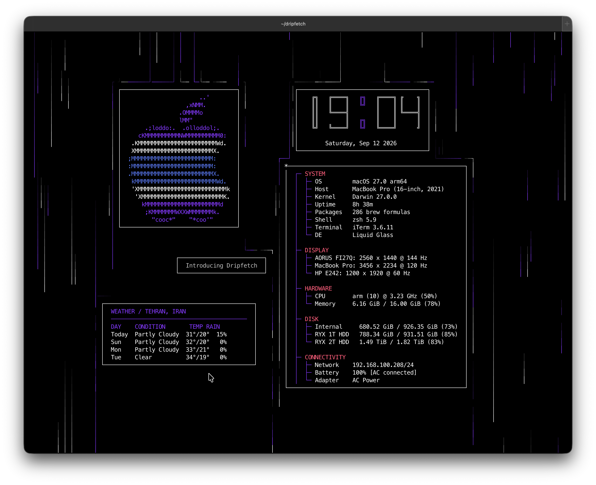
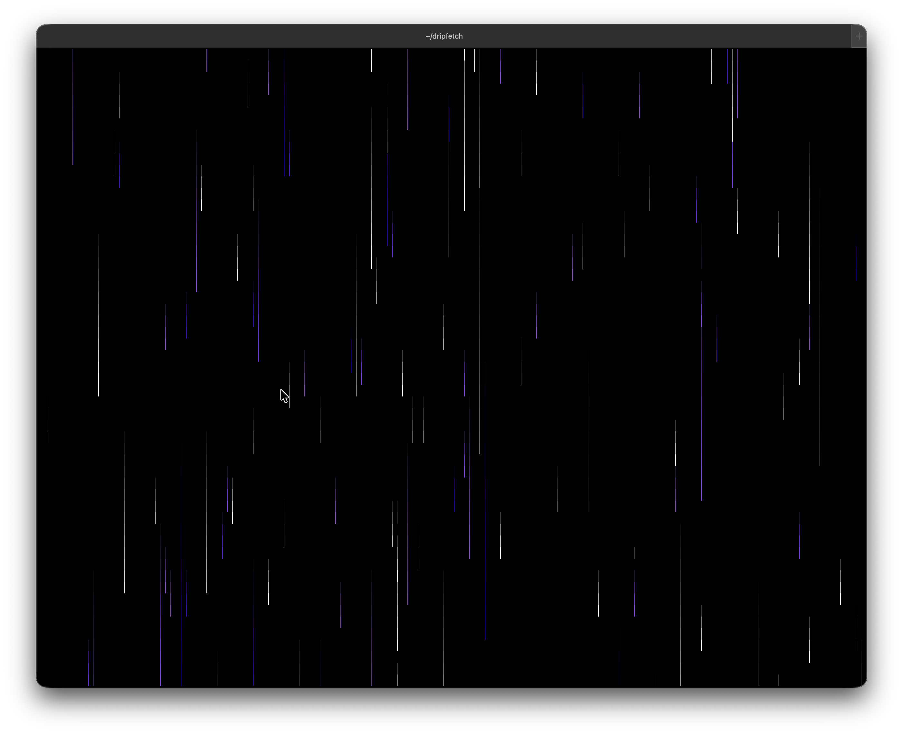
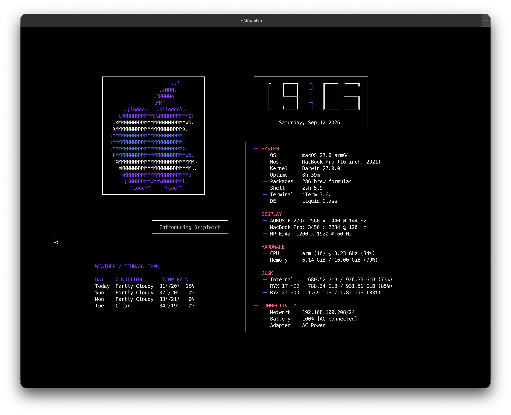
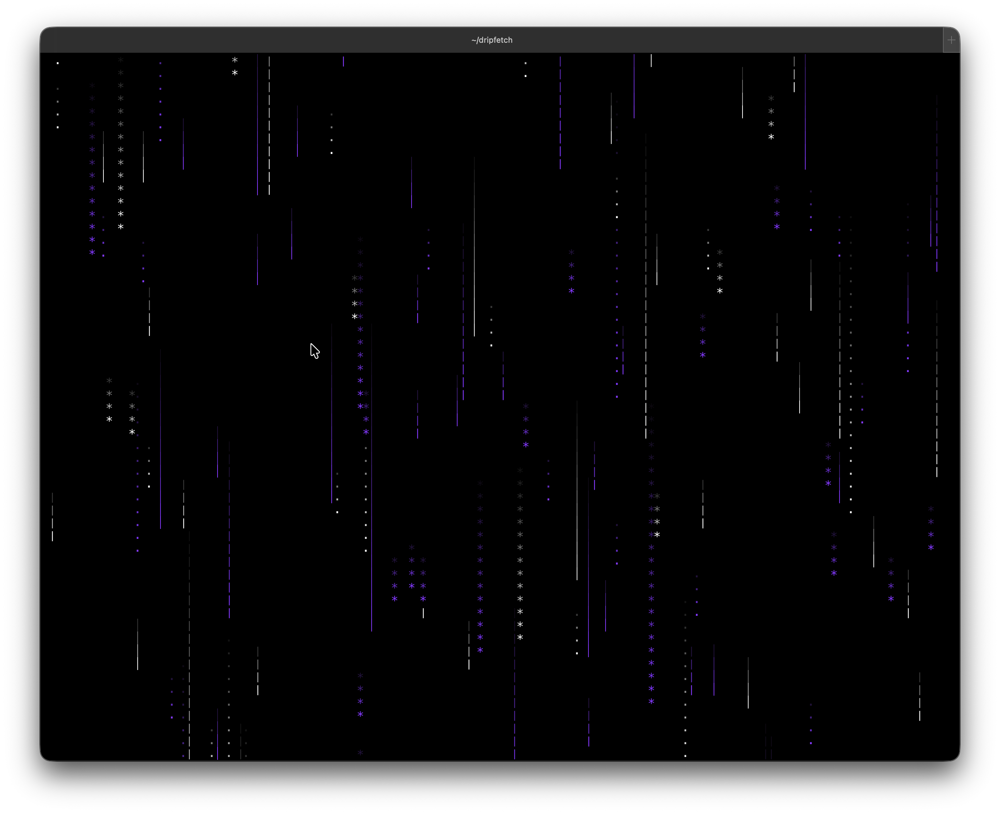

# Dripfetch

Dripfetch is a customizable terminal dashboard with animated Matrix-style rain. Place system information, ASCII logos, clocks, calendars, weather forecasts, text, and live network graphs anywhere on screen, then tune the colors, borders, and rain from YAML.

<p align="center">
  
</p>

## Highlights

- Animated terminal rain with adjustable density, symbols, colors, speed, length, and box collisions.
- Seven box types: `logo`, `sysinfo`, `clock`, `calendar`, `weather`, `net`, and `text`.
- 487 bundled ASCII logos, with automatic system detection or an explicit logo choice.
- Global box colors and padding, with single, double, titled single, titled double, and no-border styles.
- Live box placement: click a box and move it with the arrow keys or WASD; positions save to YAML.
- Multiline text with left, center, or right alignment.
- Small, medium, and big clocks with optional seconds, date, 12/24-hour time, and blinking colon.
- Current-month calendar with configurable week start.
- Mirrored braille download/upload graph.
- Weather forecast by city or coordinates through Open-Meteo. Weather lookup needs an internet connection.
- Seven ready-to-use visual presets, plus a separately available default preset at number `0`.
- Custom YAML files can be used without changing the saved default.

## Installation

Dripfetch requires Python 3.12 or newer and a POSIX terminal with curses support (macOS and Linux).

### Recommended: install with pipx

`pipx` puts Dripfetch in its own virtual environment and makes the command available on your PATH:

```bash
pipx install --python python3.12 dripfetch
```

Install `pipx` with your operating system's package manager first if it is not already installed. On macOS, for example, use `brew install pipx` and then `pipx ensurepath`.

### Install with pip

Use a virtual environment rather than installing into the operating system's managed Python:

```bash
python3.12 -m venv .venv
source .venv/bin/activate
python -m pip install --upgrade pip
python -m pip install dripfetch
dripfetch
```

### Install from the GitHub source

```bash
git clone https://github.com/a-shygun/dripfetch.git
cd dripfetch
pipx install --python python3.12 .
```

For a development checkout, use `pipx install --python python3.12 --editable .` or install into an activated virtual environment with `python -m pip install -e .`.

### Homebrew

The Homebrew formula lives in this repository. Add the tap using its explicit GitHub URL, then install Dripfetch:

```bash
brew tap a-shygun/dripfetch https://github.com/a-shygun/dripfetch.git
brew install a-shygun/dripfetch/dripfetch
```

After a new release, update Homebrew and upgrade Dripfetch with `brew update && brew upgrade dripfetch`.

### Arch Linux (AUR)

After the package is published to the Arch User Repository, install Dripfetch with an AUR helper such as `yay`:

```bash
yay -S dripfetch
```

You can also build and install it directly with `makepkg`:

```bash
git clone https://github.com/a-shygun/dripfetch.git
cd dripfetch/packaging/arch
makepkg -si
```

The AUR build uses Arch's Python and dependency packages; it does not install into a user-managed virtual environment. A release tag updates the checked-in Arch package version and checksum alongside the Homebrew formula. Once the initial AUR package exists and the repository's `AUR_SSH_PRIVATE_KEY` secret is configured, the release workflow also publishes those updated package files to the AUR automatically. See [ArchWiki's AUR guide](https://wiki.archlinux.org/title/Arch_User_Repository) for how AUR packages are reviewed and built.

For the first AUR publication, add an SSH public key to your AUR account, clone the empty package repository, and push the checked-in recipe:

```bash
git clone ssh://aur@aur.archlinux.org/dripfetch.git
cp /path/to/dripfetch/packaging/arch/{PKGBUILD,.SRCINFO} dripfetch/
cd dripfetch
git add PKGBUILD .SRCINFO
git commit -m "Initial import"
git push
```

Then add the matching private SSH key to the GitHub repository's Actions secrets as `AUR_SSH_PRIVATE_KEY`. The release workflow uses it for later AUR updates. AUR requires `PKGBUILD` and `.SRCINFO` together, and `makepkg --printsrcinfo` regenerates `.SRCINFO` if you edit the recipe.

### Debian / Ubuntu

There is no apt repository yet. Ubuntu users need a Launchpad PPA (or another apt repository) for `apt install` and automatic apt updates; Debian packaging is a separate follow-up. Meanwhile, Linux users can install Dripfetch with `pipx install --python python3.12 dripfetch` or use the source checkout instructions above.

### Optional install scripts

The repository's `install.sh` is a convenience wrapper for a local source checkout. It creates a virtual environment under `~/dripfetch`, installs the command in `~/.local/bin`, and adds that directory to the shell PATH when needed:

```bash
bash install.sh
```

Open a new terminal if `dripfetch` is not found after installation. Remove this script-managed environment with `bash uninstall.sh`; the script leaves the repository checkout and `~/.config/dripfetch/config.yaml` in place. The scripts are optional; pipx, pip, and OS package managers handle their own install and uninstall flows.

### Uninstall

```bash
pipx uninstall dripfetch
```

For a pip install, activate the same virtual environment and run `python -m pip uninstall dripfetch`. For the script-managed install, run `bash uninstall.sh`. Use `brew uninstall dripfetch`, `sudo apt remove dripfetch`, or `yay -R dripfetch` when uninstalling a package-manager version.

## First run

Start the dashboard with:

```bash
dripfetch
```

Use `q` to quit and Space to pause or resume the rain. Click a box to select it, then use the arrow keys or WASD to move it. Press Escape to deselect it. A moved box’s new center-relative position is saved in the configuration file automatically.

```bash
dripfetch --help
dripfetch --version
dripfetch --config-path
```

## Choose a configuration

List the bundled YAML configurations:

```bash
dripfetch --list-configs
# The requested single-dash spelling is supported too:
dripfetch -list-configs
```

The seven showcase configurations are `01_neon_matrix`, `02_moonlight_observatory`, `03_ops_console`, `04_citrus_pop`, `05_arcade_white`, `06_ink_and_amber`, and `07_arcade_cabinet`. Number `0` is the default layout from [`0_default.yaml`](src/dripfetch/assets/configs/0_default.yaml).

Preview a preset for one run without changing your saved configuration:

```bash
dripfetch --config 3
dripfetch --config moonlight_observatory
dripfetch --config ./my-layout.yaml
```

Save a preset as the active configuration so future plain `dripfetch` runs use it:

```bash
dripfetch --set-config 3
dripfetch -set-config moonlight_observatory
```

The `--set-config` and `-set-config` forms accept a preset number, full filename stem, or short name. `--init-config` restores the packaged default configuration in your user config directory:

```bash
dripfetch --init-config
```

The active user config normally lives at `~/.config/dripfetch/config.yaml`. Edit it directly to customize the layout, or duplicate one of the example files in [`assets/configs`](src/dripfetch/assets/configs) and run it with `--config PATH`.

## Logos

List available logo names, print one in the terminal, or save a logo choice into your active config:

```bash
dripfetch --list-logos
dripfetch -list-logos
dripfetch --print-logo arch2
dripfetch -print-logo arch2
dripfetch --set-logo arch2
dripfetch -set-logo arch2
```

The logo setter updates every existing `logo` box. If the active configuration has no logo box, it adds one. An explicit `logo:` value in YAML takes precedence over operating-system detection; omit that key to let Dripfetch detect the system logo. Logo names are the `.txt` filenames without the extension.

To choose a logo in YAML:

```yaml
boxes:
  items:
    - type: logo
      logo: arch2
      position:
        horizontal: -30
        vertical: 0
```

## Configure the dashboard

Dripfetch reads YAML. The packaged [`0_default.yaml`](src/dripfetch/assets/configs/0_default.yaml) is a commented guide to every default section, and the seven showcase configs demonstrate different layouts and palettes.

The main sections are:

| Section | What it controls |
| --- | --- |
| `background` | Terminal background color. |
| `rain` | Collision behavior, density, symbols, weighted colors, speeds, and drop lengths. |
| `boxes.border` | Default border style for all boxes: `single`, `double`, `titled_single`, `titled_double`, or `none`. |
| `boxes.border_color` | Shared box border color. |
| `boxes.text_color` | Shared content text color. |
| `boxes.accent_color` | Shared title and highlight color. |
| `boxes.padding` | Inner horizontal and vertical spacing. |
| `boxes.items` | The ordered list of boxes, their type-specific options, titles, and positions. |

Colors use `#RRGGBB` or `#RRGGBBAA`. Box positions are offsets in terminal cells from the centered location: positive horizontal values move right and positive vertical values move down. Dragging a box with the mouse or moving it with the keyboard writes updated position values to the active YAML file.

### Example: a compact layout

```yaml
background: "#080B12"
rain:
  collision: true
  intensity: 120
  character: ["│", "┃", "╎"]
  colors:
    - [0.7, "#21F7A8"]
    - [0.3, "#45B8FF"]
  speeds:
    - [0.5, 30]
    - [0.5, 50]
  lengths:
    - [0.8, 6]
    - [0.2, 14]
boxes:
  border: titled_single
  border_color: "#50FFC1"
  text_color: "#D9E5F4"
  accent_color: "#50FFC1"
  padding:
    horizontal: 2
    vertical: 0
  items:
    - type: logo
      logo: arch2
      position: {horizontal: -32, vertical: 0}
    - type: clock
      clock_size: small
      clock_24h: true
      show_seconds: true
      show_date: true
      position: {horizontal: 28, vertical: -7}
    - type: text
      title: NOTE
      text: |
        Dripfetch is running.
        Edit this YAML to make it yours.
      alignment: center
      position: {horizontal: 28, vertical: 7}
```

Rain `colors`, `speeds`, and `lengths` are weighted lists in `[probability, value]` form; probabilities in each list must add up to `1.0`. Box text can use YAML's `|` block style for preserved multiline text. Text alignment is `left`, `center`, or `right`.

### Box options

- **`logo`** — set `logo: NAME` to choose a bundled logo. If omitted, Dripfetch detects an operating-system logo. Optionally set `colors: ["#8747FF", "#FFFFFF"]` to color its `$1`, `$2`, and later ASCII color markers in order; without it, the global accent/text/border palette is used.
- **`sysinfo`** — show system details. Set individual `sections` (`system`, `display`, `hardware`, `disk`, `connectivity`) to `false` to hide them.
- **`clock`** — `clock_size` is `small`, `medium`, or `big`; `clock_style` is `single` or `double`. Configure `clock_24h`, `show_seconds`, `show_am_pm`, `blink_colon`, and `show_date` with booleans.
- **`calendar`** — set `starting_day` to `monday`, `sunday`, or `saturday`.
- **`weather`** — set a city in `location` (or provide coordinates in a hand-written config), `units` to `celsius`/`metric` or `fahrenheit`/`imperial`, and `days` from 1 to 7.
- **`net`** — configure graph `width`, `height`, and sampling `interval` in seconds. Download and upload are drawn as mirrored braille plots.
- **`text`** — set `text` to a string or multiline YAML block and `alignment` to `left`, `center`, or `right`.

Titles can be added to boxes with `title: ...`. Box text and borders use the palette under `boxes` so the dashboard remains visually consistent.

## Gallery

### Default layout


### Seven bundled themes

<table>
  <tr>
    <td><br><b>01 · Neon Matrix</b></td>
    <td><br><b>02 · Moonlight Observatory</b></td>
  </tr>
  <tr>
    <td><br><b>03 · Ops Console</b></td>
    <td><br><b>04 · Citrus Pop</b></td>
  </tr>
  <tr>
    <td><br><b>05 · Arcade White</b></td>
    <td><br><b>06 · Ink and Amber</b></td>
  </tr>
  <tr>
    <td><br><b>07 · Arcade Cabinet</b></td>
  </tr>
</table>

### Individual features

<table>
  <tr>
    <td><br><b>Terminal dashboard</b></td>
    <td><br><b>Animated rain</b></td>
  </tr>
  <tr>
    <td><br><b>Configurable boxes</b></td>
    <td><br><b>Rain density and colors</b></td>
  </tr>
</table>

## CLI reference

| Command | Action |
| --- | --- |
| `dripfetch` | Run with the active user configuration. |
| `dripfetch --config NUMBER\|NAME\|PATH` | Run once with a bundled preset or custom YAML file. |
| `dripfetch --list-configs` / `-list-configs` | List bundled config numbers and names. |
| `dripfetch --set-config NUMBER\|NAME` / `-set-config` | Save a bundled preset as the active config. |
| `dripfetch --list-logos` / `-list-logos` | List bundled logo names. |
| `dripfetch --print-logo NAME` / `-print-logo` | Print an ASCII logo. |
| `dripfetch --set-logo NAME` / `-set-logo` | Save a logo choice in the active config. |
| `dripfetch --list-boxes` | List available box types. |
| `dripfetch --config-path` | Print the active config path. |
| `dripfetch --init-config` | Restore the packaged default config. |
| `dripfetch --help` | Show all command-line options. |

## Project files

- `src/dripfetch/` — application source, packaged default config, logos, presets, and theme screenshots.
- `docs/` — demo GIF and feature screenshots used above.
- `install.sh` and `uninstall.sh` — local install and removal helpers.

## License and security

Dripfetch is released under the [MIT License](LICENSE). See [SECURITY.md](SECURITY.md) for private vulnerability reporting instructions.
