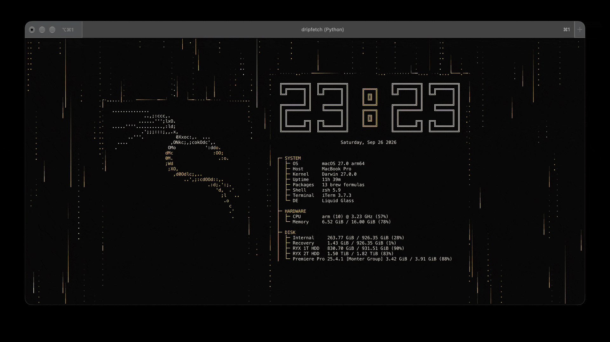
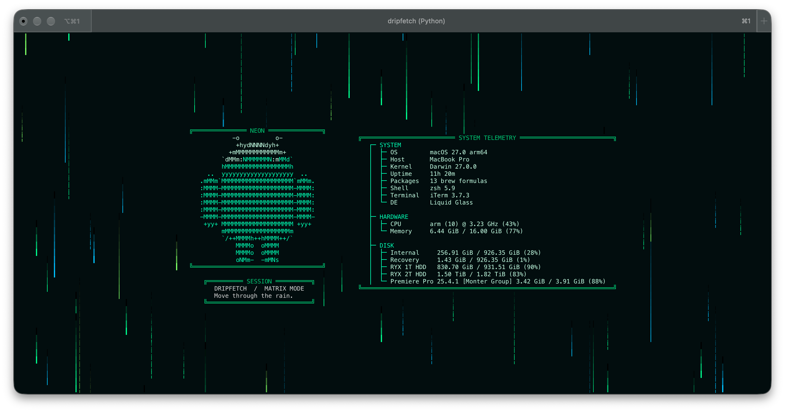
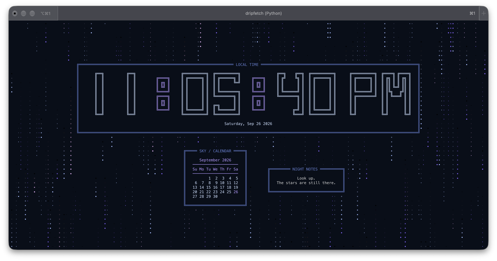
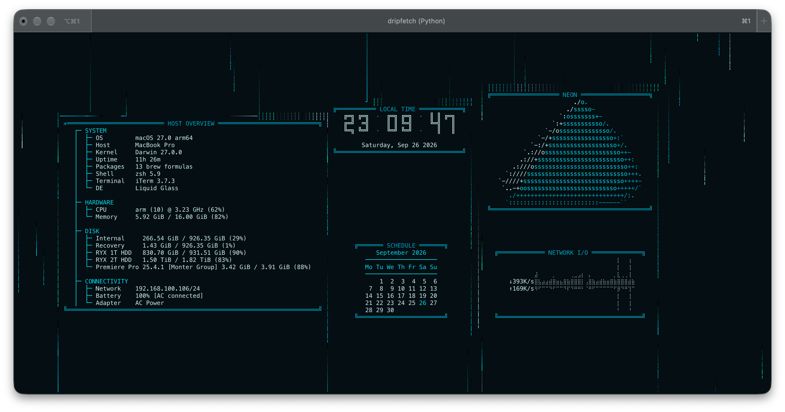
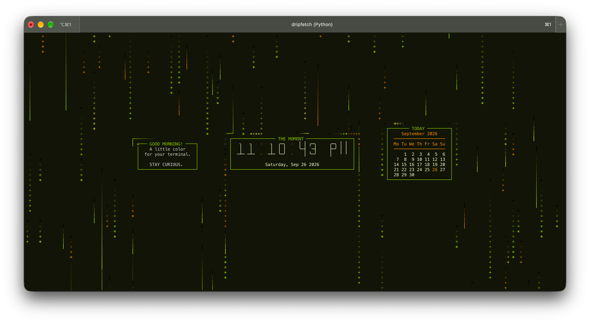
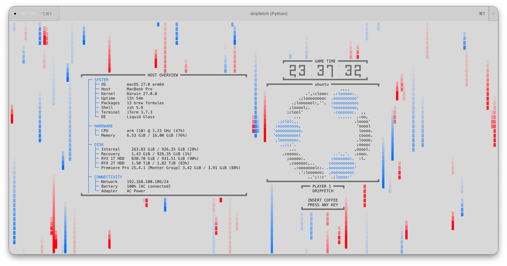
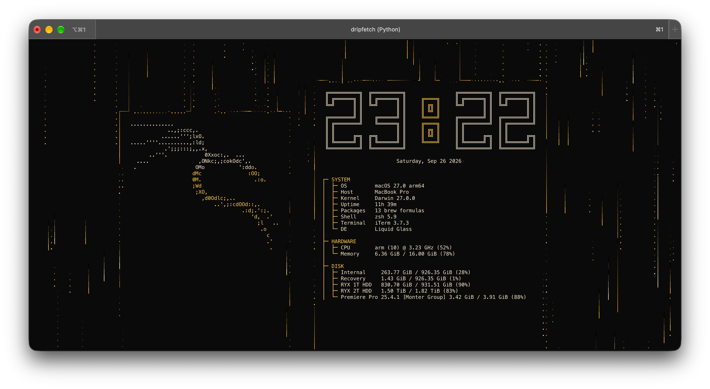
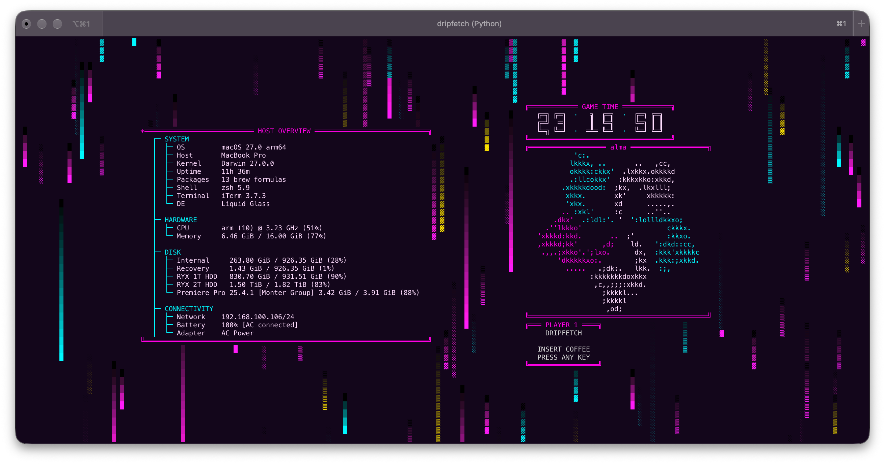
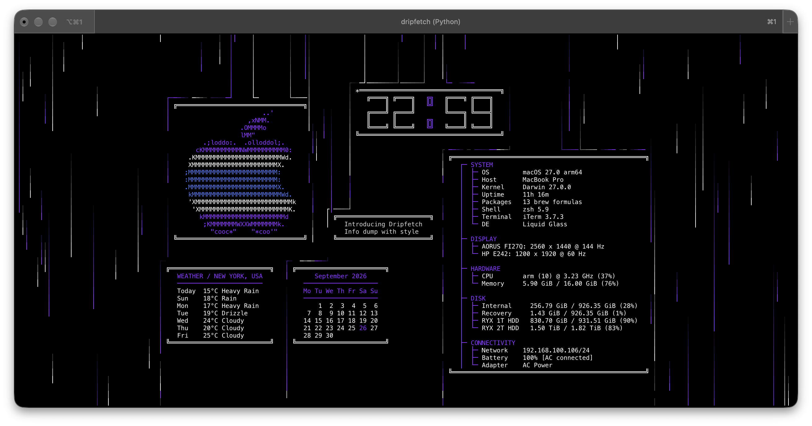

# Dripfetch

A customizable terminal dashboard with animated Matrix-style rain. Place system info, logos, clocks, calendars, weather, text, and network graphs anywhere on screen, and tune everything from one YAML file.

[](https://github.com/a-shygun/dripfetch/actions/workflows/release.yml)
[](https://github.com/a-shygun/dripfetch/releases/latest)
[](https://pypi.org/project/dripfetch/)
[](https://www.python.org/downloads/)
[](LICENSE)

<p align="center">
  
</p>

## Features

- Rain with adjustable density, symbols, colors, speed, length, and box collisions
- Seven box types: `logo`, `sysinfo`, `clock`, `calendar`, `weather`, `net`, `text`
- 487 ASCII logos, auto-detected from your OS or chosen explicitly
- Five border styles, shared palette and padding
- Click a box and move it with arrows or WASD; the position is saved to YAML
- Seven presets plus a default (`0`), validated configs with clear error paths

## Install

Requires Python 3.10+ and a POSIX terminal with curses (macOS, Linux).

```bash
pipx install dripfetch                       # recommended
python -m pip install dripfetch              # inside a virtual environment
pipx install .                               # from a source checkout

brew tap a-shygun/dripfetch https://github.com/a-shygun/dripfetch.git
brew install a-shygun/dripfetch/dripfetch    # Homebrew

yay -S dripfetch                             # Arch (AUR)
```

### GitHub release downloads

Each [GitHub Release](https://github.com/a-shygun/dripfetch/releases) includes these files (`0.5.0` below is an example; use the version you want):

- `dripfetch_0.5.0_linux_amd64.deb` — Debian or Ubuntu on x86_64
- `dripfetch_0.5.0_linux_arm64.deb` — Debian or Ubuntu on ARM64
- `dripfetch_0.5.0_macos_x86_64.tar.gz` — macOS on Intel
- `dripfetch_0.5.0_macos_arm64.tar.gz` — macOS on Apple Silicon
- `dripfetch-0.5.0-py3-none-any.whl` and `dripfetch-0.5.0.tar.gz` — Python wheel and source distribution
- `dripfetch_checksums.txt` — SHA-256 hashes for the downloadable package files

On Debian or Ubuntu, download the `.deb` matching your CPU architecture, then install it from the folder where it was downloaded:

```sh
sudo apt install ./dripfetch_0.5.0_linux_amd64.deb
```

Use the `linux_arm64` filename on an ARM64 machine. The command installs the `dripfetch` program, which you can then run from a terminal.

On macOS, download the archive matching your Mac's processor, then extract and install the command into your personal `~/.local/bin` directory:

```sh
tar -xzf dripfetch_0.5.0_macos_arm64.tar.gz
mkdir -p "$HOME/.local/bin"
install -m 755 dripfetch "$HOME/.local/bin/dripfetch"
```

Use the `macos_x86_64` filename on an Intel Mac. If `~/.local/bin` is not on your `PATH`, add it in your shell configuration. To install the Python wheel instead, use `python -m pip install ./dripfetch-0.5.0-py3-none-any.whl` in a virtual environment.

To check a download, calculate its SHA-256 hash with `sha256sum <filename>` on Linux or `shasum -a 256 <filename>` on macOS, then compare it with the matching filename in `dripfetch_checksums.txt`.

`bash install.sh` sets up a local virtual environment in `~/dripfetch` and links `dripfetch` into `~/.local/bin`; `bash uninstall.sh` removes it and keeps your config.

**Uninstall:** `pipx uninstall dripfetch` · `python -m pip uninstall dripfetch` · `brew uninstall dripfetch` · `yay -R dripfetch`

### Nix

`psutil` and `ruamel.yaml` are **runtime** dependencies, not native build inputs. Put them in `dependencies` (or `propagatedBuildInputs`), not `nativeBuildInputs`, or the installed command fails with `ModuleNotFoundError`:

```nix
python3Packages.buildPythonApplication {
  pname = "dripfetch";
  version = "0.4.0";
  pyproject = true;
  src = ./.; # when evaluated from the repository root
  build-system = [ python3Packages.setuptools ];
  dependencies = with python3Packages; [ psutil ruamel-yaml ];
}
```

Temporarily build and run via nix flakes (no install)
```sh
nix run github:a-shygun/dripfetch?dir=packaging/nix
```

Install via nix flakes

1. Add flake input

flake.nix
```nix
{
  inputs = {
    nixpkgs.url = "github:NixOS/nixpkgs/nixos-unstable";
    dripfetch = {
      url = "github:a-shygun/dripfetch?dir=packaging/nix";
    };
  };
}
```

2. Install via system config or home-manager

configuration.nix
```nix
environment.systemPackages = with pkgs; [
  inputs.dripfetch.packages.${pkgs.stdenv.hostPlatform.system}.default
];
```

or

home.nix
```nix
home.packages = with pkgs; [
  inputs.dripfetch.packages.${pkgs.stdenv.hostPlatform.system}.default
];
```

## Usage

```bash
dripfetch
```

| Key | Action |
| --- | --- |
| `q` | Quit |
| `Space` | Pause / resume rain |
| Click | Select a box |
| Arrows / `WASD` | Move the selected box (saved automatically) |
| `Esc` | Deselect |

### Commands

| Command | Action |
| --- | --- |
| `dripfetch -c, --use-config NUMBER\|NAME\|PATH` | Run with a preset or YAML file for this session only |
| `dripfetch --set-config NUMBER\|NAME\|PATH` | Save a preset or file as the active config |
| `dripfetch --set-logo NAME` | Save a logo in the active config |
| `dripfetch --list-configs` / `--list-logos` / `--list-boxes` | List presets, logos, or box types |
| `dripfetch --print-logo NAME` | Print a logo |
| `dripfetch --config-path` | Show the config path in use |
| `dripfetch --init-config` | Create or restore the default config |
| `dripfetch -v, --version` / `--version-raw` | Show the version |
| `dripfetch -h, --help` | Show help |

```bash
dripfetch --use-config 2                  # try a preset
dripfetch -c ./my-layout.yaml             # try your own file
dripfetch --set-config moonlight_observatory
```

Presets are `01_neon_matrix`, `02_moonlight_observatory`, `03_ops_console`, `04_citrus_pop`, `05_arcade_white`, `06_ink_and_amber`, `07_arcade_cabinet`, and `0` for the default. A selector can be the number, full name, or short name.

### Lower CPU usage

The rain is the main cost. **Lower `rain.intensity` to use less CPU**; `0` disables rain and leaves the dashboard nearly idle. Around `20`–`60` suits a laptop on battery. Pausing with `Space` and shorter `lengths` also help.

## Configuration

The active config is `~/.config/dripfetch/config.yaml`. The packaged [`0_default.yaml`](src/dripfetch/assets/configs/0_default.yaml) documents every option. Moving a box writes its new position back to the file in use.

```yaml
background: "#080B12"
keyboard:
  layout: qwerty            # qwerty | azerty | qwertz
rain:
  collision: true
  intensity: 60             # lower = less CPU
  character: ["│", "┃", "╎"]
  colors:  [[0.7, "#21F7A8"], [0.3, "#45B8FF"]]   # [probability, value], must sum to 1
  speeds:  [[0.5, 30], [0.5, 50]]                 # ms per step, lower = faster
  lengths: [[0.8, 6], [0.2, 14]]
  effects: {acceleration: false, splash: false}
boxes:
  border: titled_single     # single | double | titled_single | titled_double | none
  border_color: "#50FFC1"
  text_color: "#D9E5F4"
  accent_color: "#50FFC1"
  padding: {horizontal: 2, vertical: 0}
  items:
    - type: logo
      logo: arch2
      position: {horizontal: -32, vertical: 0}
    - type: clock
      clock_size: small
      show_date: true
      position: {horizontal: 28, vertical: -7}
    - type: text
      title: NOTE
      text: |
        Dripfetch is running.
      alignment: center
      position: {horizontal: 28, vertical: 7}
```

Colors are `#RRGGBB` or `#RRGGBBAA`. Positions are cell offsets from the center (positive = right / down).

### Box options

| Type | Options |
| --- | --- |
| `logo` | `logo` (omit to detect your OS), `colors` for `$1`, `$2`, … markers |
| `sysinfo` | `sections`: `system`, `display`, `hardware`, `disk`, `connectivity` (true/false) |
| `clock` | `clock_size` small/medium/big, `clock_style` single/double, `clock_24h`, `show_seconds`, `show_am_pm`, `blink_colon`, `show_date` |
| `calendar` | `starting_day`: monday, sunday, saturday |
| `weather` | `location` or `latitude`/`longitude`, `units` celsius/fahrenheit (or metric/imperial), `days` 1–7. Uses Open-Meteo and needs internet. |
| `net` | `width`, `height`, `interval`, `download_color`, `upload_color` |
| `text` | `text` (string, block, or list), `alignment` left/center/right |

Every box also accepts `title`, `border`, and `position`.

## Gallery

<table>
  <tr>
    <td><br><b>01 · Neon Matrix</b></td>
    <td><br><b>02 · Moonlight Observatory</b></td>
  </tr>
  <tr>
    <td><br><b>03 · Ops Console</b></td>
    <td><br><b>04 · Citrus Pop</b></td>
  </tr>
  <tr>
    <td><br><b>05 · Arcade White</b></td>
    <td><br><b>06 · Ink and Amber</b></td>
  </tr>
  <tr>
    <td><br><b>07 · Arcade Cabinet</b></td>
    <td><br><b>0 · Default</b></td>
  </tr>
</table>

## Project layout

```
src/dripfetch/
├── app/      cli.py (arguments), app.py (main loop), config.py (YAML + validation), terminal.py (renderer)
├── box/      base, manager, layout, placement, border, colors, registry, validation
│   └── types/  one module per box type; helper/ holds their support code
├── rain/     manager, spawning, physics, rendering, colors, models, constants
└── assets/   logos/*.txt and configs/*.yaml
Formula/      Homebrew formula        packaging/arch/  AUR PKGBUILD
packaging/nix/  Nix flake and package expression
```

To add a box type, drop a module with one `BaseBox` subclass into `box/types/`. It is discovered automatically and the module name becomes its `type`. An optional `validate_config(cls, item, path)` classmethod validates its options.

## License

[MIT](LICENSE). Report vulnerabilities privately, see [SECURITY.md](SECURITY.md).
